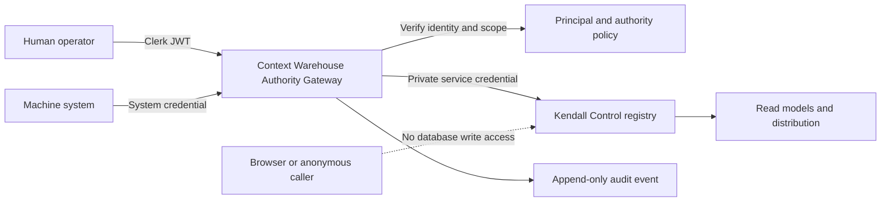

# Context Warehouse Authority Gateway Contract

**Contract ID:** KP-AUTH-GW-001  
**Status:** Proposed implementation contract; required before write restoration  
**Owner:** Context Warehouse  
**Security boundary:** Human and system registry mutations  
**Production dependency:** KP-CTRL-DB-REC-001

## 1. Purpose and invariant

The Authority Gateway is the only approved network path for Context Warehouse registry mutations. It authenticates the actor, resolves an internal principal, authorizes the action against an owning-system scope, enforces lifecycle transitions, invokes private database commands, and records an attributable audit event.

No browser, product, agent, connector, CLI, or automation may call a registry-write database function using a Supabase publishable key. No write path may be restored until the gateway passes the acceptance gates in this contract.

## 2. Trust boundaries



- Clerk is the human identity provider, not the authorization database.
- An internal UUID `principal` represents the stable Kendall actor.
- `identity_subjects(provider, external_subject, principal_id)` maps Clerk and future providers without forcing external string IDs into UUID columns.
- `principal_system_roles(principal_id, system_id, role_key, active)` owns human authorization.
- `system_credentials` represents machine principals, stores only credential hashes/references, and carries explicit system/action scopes.
- The gateway alone holds protected database service credentials. They are never exposed to clients or logs.

## 3. Public command interface

### Endpoint

`POST /v1/warehouse/registry/commands`

### Authentication

- Humans: `Authorization: Bearer <Clerk JWT>`.
- Machines: `Authorization: Bearer <system credential>` with a distinct credential issuer/type.
- The gateway rejects absent, expired, revoked, wrongly issued, wrongly targeted, or unmapped credentials.

### Request

```json
{
  "command_id": "uuid",
  "action": "register_draft",
  "component_type": "agent",
  "component_id": null,
  "owning_system_key": "foundry",
  "expected_version": null,
  "payload": {},
  "reason": "Initial registration"
}
```

Required behavior:

- `command_id` is globally unique and provides idempotency.
- The actor is derived from verified credentials; caller-supplied actor fields are rejected.
- `owning_system_key` must match an active scope on the resolved principal.
- `expected_version` is required for mutation of an existing record and prevents lost updates.
- Unknown request properties, unsupported actions, and invalid component payloads are rejected.
- Responses never include secrets, credential hashes, or unrestricted authority records.

### Success response

```json
{
  "command_id": "uuid",
  "result": "accepted",
  "component_id": "uuid",
  "part_number": "KF-AGT-001",
  "version": "0.1.0",
  "status": "draft",
  "audit_event_id": "uuid"
}
```

### Error contract

- `400 INVALID_COMMAND` — malformed or semantically invalid request.
- `401 UNAUTHENTICATED` — missing or invalid credential.
- `403 UNAUTHORIZED` — valid principal lacks action/system scope.
- `404 TARGET_NOT_FOUND` — target or owning system is not available to the actor.
- `409 VERSION_CONFLICT` — `expected_version` is stale.
- `409 IDEMPOTENCY_CONFLICT` — command ID was previously used with different content.
- `422 INVALID_TRANSITION` — lifecycle transition is not permitted.
- `503 WRITE_PATH_DISABLED` — gateway/database safety switch is closed.

## 4. Lifecycle commands and authority

| Command | Result | Minimum authority |
|---|---|---|
| `register_draft` | Creates a draft and atomically issues its part number | Registrar in owning system or scoped machine |
| `update_draft` | Updates mutable draft fields with version check | Registrar in owning system or scoped machine |
| `submit_review` | Moves `draft` to `in_review` | Registrar in owning system |
| `return_to_draft` | Returns review with a reason | Reviewer in owning system |
| `certify_version` | Creates an immutable certified version and evidence record | Human certifier; machine certification prohibited |
| `deprecate_version` | Stops recommendation for new use; preserves history | Lifecycle manager |
| `recall_version` | Immediately blocks distribution and starts where-used analysis | Recall authority |
| `retire_version` | Closes use after disposition evidence | Lifecycle manager |

The current registry status columns do not model recall or immutable component versions sufficiently. The gateway implementation must introduce explicit version and lifecycle-event records before enabling certification, deprecation, recall, or retirement commands. Legacy `p_status` inputs must never determine lifecycle state.

## 5. Transaction and audit requirements

- Part-number issuance, draft creation, idempotency registration, and success audit occur in one database transaction.
- Denied and failed commands also write an audit event through a separate failure-safe path when technically possible.
- Audit fields include principal, credential type, system, action, target, result, command ID, correlation ID, policy version, timestamp, and non-secret metadata.
- Retrying an identical `command_id` returns the original result without issuing another part number.
- Reusing a `command_id` with different normalized content returns `IDEMPOTENCY_CONFLICT`.
- Database functions used by the gateway live in a private schema or have execution limited to the protected gateway role.
- Every `SECURITY DEFINER` function fixes its `search_path`, schema-qualifies referenced objects, and receives an explicit privilege review.

## 6. Operating controls

- A default-off production write safety switch gates all commands.
- Enabling the switch requires a verified gateway deployment, completed database migration, smoke-test evidence, and named owner approval.
- Credentials are stored in managed secret storage and rotated without database or client releases.
- Machine credentials are independently revocable and cannot cross owning-system boundaries.
- Rate limits apply by principal, credential, system, and action.
- Logs redact tokens, authorization headers, database credentials, and sensitive payload fields.
- Gateway health does not imply write enablement; readiness reports identity verification, policy loading, database reachability, audit reachability, and safety-switch state separately.

## 7. Restoration gates

Registry writes remain disabled until all gates pass in production:

1. Clerk JWT verification rejects invalid issuer, audience, signature, expiry, and unmapped subject.
2. Internal principal and system membership mapping replaces direct Clerk-ID/UUID assumptions.
3. Machine credentials are hashed/referenced, scoped, revocable, and never client-visible.
4. Anonymous, publishable-key, and ordinary authenticated direct RPC calls remain denied.
5. Cross-system writes and unauthorized lifecycle actions are denied and audited.
6. Registration cannot set `certified`, `deprecated`, `recalled`, or `retired` directly.
7. Part-number issuance is atomic and idempotent under concurrent requests.
8. Certified versions and their AI BoMs are immutable.
9. Recall blocks new distribution and produces a where-used work item.
10. Security and performance advisors run after migration; all security findings are fixed or explicitly dispositioned.
11. Preview and production smoke tests pass, including safety-switch rollback.
12. The Engineering Office records deployment ID, commit, migration version, policy version, test evidence, owner approval, and verification timestamp.

Only after all gates pass may `service_role`-backed gateway writes be enabled. Direct grants to `PUBLIC`, `anon`, or general `authenticated` remain permanently prohibited.

## 8. Out of scope for this contract

- Changing public registry read policy.
- Migrating product transaction databases into the Context Warehouse.
- Giving Context Block Studio authority over global templates.
- Selecting the final durable workflow engine.
- Restoring any legacy client write behavior.

Those changes require separate work packages and may not weaken this authority boundary.

